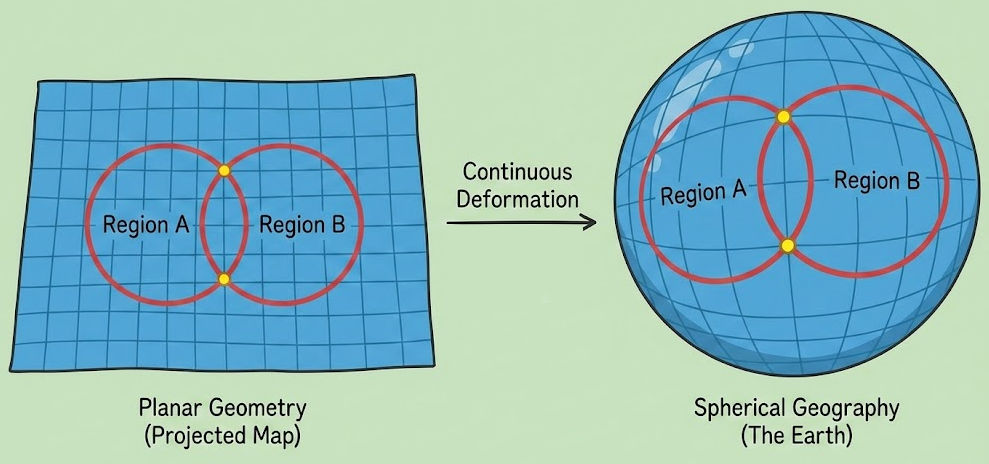

Title: Announcement: Esqueleto postgis v4
Date: 2026-02-22 22:00
Category: tools
OPTIONS: toc:nil
Tags: programming, haskell, database

Hi friends!
I was recently tasked again with figuring out where
stuff is in space.
I decided this was an opportunity to cleanup
the [esqueleto library](https://hackage.haskell.org/package/esqueleto-postgis-4.0.1) and releasing v4!
Friends, I lied.
I was in fact terrified I did the projections of geography wrong
by using the geometry type, 
and hoped I could repair this by introducing distinctions between geography and geometry.

Turns out I was only using topology functions and
as we all know[^i-didn't-know] topology functions don't
change behavior based on projections (of space).
Actually I was doing things right all along, 
except I didn't know I was doing things right.
Ignorance is bliss I suppose?

<figure id="particle">

<figcaption>If we make a sphere out of the map, the circles remain intersecting because intersection is topological. Distance does change however!</figcaption>
</figure>

Anyway as a side effect we now do have full
type distinctions between geography and geometry in [esqueleto-postgis](https://hackage-content.haskell.org/package/esqueleto-postgis-4.0.0/docs/Database-Esqueleto-Postgis.html#t:SpatialType).
This will allow you to do accurate measurements of distance for example 
over deformed spaces, such as spherical planet, 
and the library will guide you.
This isn't useful for me right now, 
but it may be in the future.
Perhaps any of you guys do want to use it? 

Aside from the type-safety goodness, 
I also cleaned house: 
We adopted `wkt-geom` which was unmaintained, allowing us to release on Stackage!
Added `st_dwithin` for range finding, and `st_distance` for distance measurements,
and restricted some functions to just geometry preventing runtime errors.

There is also this whole thing about SRIDs. 
Which appear to be [localized projections](https://epsg.io/27700) of [the earth](https://epsg.io/3857) on a map.
It also includes details around units,
going from meters, to feet, to degrees.
I'm not happy with the current encoding
but I doubt I need that a lot.
The tools are there now in principle to transform
between SRIDs. 
So you could have indexes and relations between various
local maps for example.
Let me know if you need a nicer encoding for this.[^crazy-db-arc]

[^i-didn't-know]: I didn't know this.

[^crazy-db-arc]: My crazy database arc continues. I'm a level 9 database witch now. I maintain so many database libraries. So many. I've already seen visions of me modifying postgres directly, we all know this is coming.
