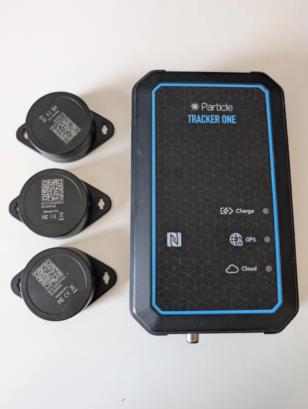

Title: Stacked against us
Date: 2025-03-26 20:49
Modified: 2025-03-27 13:09
Category: tools
OPTIONS: toc:nil
Tags: work, remote, haskell, programming

September 2023, I knew I was in for a wild ride when I won this contract.
I already coached other developers in a commercial setting,
and I understood what was asked of me.
My goal was to get two existing developers comfortable
with Haskell while at the same time increasing productivity.

In my first week I started with understanding 
the code base[^code-base] and what they're building.
They help precast factories find their produced walls called units. [^find-wall]
This project puts Bluetooth tags on precast walls, 
so people don't lose them at the factory.
With these tags they can find them easily, because they provide an active signal.
So the Haskell web app receives all that data and makes a nice interface out of it.
The interface provides a text box to search for a unit[^eg-wall], which can be rendered on a map.

[^code-base]: So this also involves getting familiar with whatever style the organization is using. Usually various companies have various styles.
[^find-wall]: How do you lose a wall?
              Imagine a concrete precast factory that constantly is churning
              out walls and other precast elements.
              These walls are stored in a yard several football fields wide, 
              filled with gray concrete.
              Normally they record where they're stored in [SAP](https://www.sap.com/) an inventory tracking tool.
              If they need the wall below another one, they may move it somewhere else and SAP gets stale.
              In practice these walls may be moved a lot and get lost.
              These walls often wait for months to be shipped to a construction site.

[^eg-wall]: Eg a precast wall. Several of which stacked upon eachother is called a stack.

Ironically enough my first contributions to this organization weren't
about Haskell or teaching at all,
there was an "escalation" on the Monday I started,
and they managed to react 3 days after the event(!)
Apparently they barely had any monitoring in place.
I brought up how slow it was to react like that in one of the first meetings. 
This caused shock waves through the entire organization
and they re-prioritized monitoring for all other projects as well.[^engineering]
Not surprising that many of my initial Haskell contributions were just about improving the engineering side.
For example by using [annotated exceptions](https://hackage.haskell.org/package/annotated-exception) 
which gave us stack traces, 
or making [Katip](https://hackage.haskell.org/package/katip)[^katip] and logz work together, giving us production logs and monitoring.

[^engineering]: You'd say having monitoring is rather important, but startups often forget these "basics" of software engineering.

[^katip]: Katip is great and structured logging is really nice, 
          that service logz is fragile however,
          it denies the existence of heterogeneous lists in Java which Haskell tuples get encoded to as JSON.

When I joined there was only a single factory actually using this system,
and the project was filled with bugs.
My first impression was that the engineers were intensely focused on architecture,
they feared losing productivity due to having "too much code".
However, this came at the cost of getting stuff working.
Since this is a mostly TypeScript organization that just adopted Haskell for this project as
an experiment, it makes sense to be afraid of code bloat.
Another issue was that the people who knew Haskell preferred
using the most advanced features available, rather than just focusing on the basics.
For example they would teach how to use lens, instead of simple record updates.
This made it feel as if there was an endless mountain to climb of stuff to learn.
I quickly proposed focusing on [simple Haskell](https://www.simplehaskell.org/).
This would cut down on the size of the learning curve and allow people to focus
on building features, 
so they'd feel productive and could explore the remainder of the language at their own pace.
Furthermore, the relational aspects of Postgres were in large parts of the system
ignored. For example a load of units, 
which in reality is a wagon of precast walls, 
was represented as a JSON blob. [^mtl-issues]
There was no `load` table and a `load_unit_connection` table, just a blob.
Ironically enough this caused additional code to retrieve the relational aspects.
Culturally the focus was "architecture" rather than making something work.
Over engineering things that don't matter was the name of the game.
This isn't unique to this project, at other companies I've seen similar discussion.
Trying to achieve perfect code essentially.
What was special is that they were still obsessed
over this, despite how buggy and slow development was.

[^mtl-issues]: There still to this day is an entire [MTL]({filename}/mtl.md) based framework to stub out 
               logic and run tests in memory.
               ONE of my first suggestions was to delete that and instead just use higher order functions to stub things out, 
               but some high up chiefs decided against that because they liked seeing the possible effects in the type signature.
               Because most logic resided in the database I think at this point I've deleted most
               tests that use this. 
               These in memory tests didn't ever catch any bugs and were just a maintenance burden.
               Instead we now do full integration tests that hit the database.
               The concern down the line is that our test suite becomes slow, 
               but that's a problem for future me.
               One of my main productivity increase was to not be afraid of introducing tech debts like these.
               Because if the project dies right now because you don't get anything done
               having perfect code just doesn't matter.
               And I've kicked that "slow tests" can extremely far down the road at previous jobs.
               At supercede we had thousands of database hitting tests still run under 10 minutes.

I learned from the previous contractor that at some point some engineers actually revolted against
the use of Haskell!
There were more people doing this,
but they all transferred themselves out of this project.
How ironic is that? [^irony]
Anyway, this gave me some dreadful premonition.
It felt like everything was still going awfully and things were getting worse!

[^irony]: Normally it's the software engineers asking for haskell and managers resisting the encroachment.

In the second week I discovered that the teamlead was going to quit. 
He was one of two people I was supposed to teach Haskell.
I never got the opportunity to do this.
He'd be gone in a month.
He was seething against Haskell.
He had been only using [HLS](https://github.com/haskell/haskell-language-server)[^hls] for compiler feedback and it's unreliable, [^infuriating]
Furthermore, he claimed Haskell had caused a huge amount of "mental overhead".[^architecutre-ii]
But after talking to him I learned his underlying frustration was with
upper management ignoring his recommendations.
Ironically enough, despite our differences in "ideology"[^ideology], I liked this guy.
He wasn't bad at his job[^tech-choises], but dear lord, he was pissed!

[^hls]: Haskell language server. an LSP implementation for haskell. this provides IDE like experience for editors. It'll make your text editor give hints.

[^infuriating]: Asside from the time pressure for producing features and having to learn haskell, 
                having this program randomly crash on you as your only source of feedback is infuriating.

[^architecutre-ii]: If they were to not obsess over architecture all the time this wouldn't have been such a big problem.
                    By the time I joined this guy already knew how to navigate syntax and how to fix bugs rapidly.
                    The mental overhead was of his own creation.

[^ideology]: I call it ideology because I think programming languages are more like a culture you buy into
             rather than a mere technological choice.
             Every general purpose programming language is Turing complete and therefore equivalent in capability.
             So logically what remains is cultural preference.
             In this view choosing one is more like choosing a "workstyle", a "way of thinking" or set of ideas to buy into.
             As opposed the more traditional view which says.
             It makes more sense to ask "what system of values Haskell promotes versus JavaScript?",
             rather than to ask "what can I do with  Haskell verses JavaScript?".
             The latter question is meaningless.
             Having said that I do think you can be a lot more productive in Haskell than JavasScript because
             the libraries are better designed, with fewer surprises and the type system will catch so
             many small issues in a thorough manner. 
             It's better then other commercially available typed languages because it reduces to a single expression.
             This difference can be reduced to a value question as well:
             Do you care about individual developer productivity, 
             or do you care about having a sufficiently large manpower pool?
             There are more JavaScript developers than Haskell developers.

[^tech-choises]: Later I found out that he made a bunch of suspicious technical choices, 
                 but I think most of these decisions came from being angry instead of lack of skill

After two weeks we can safely say this project was literally falling apart,
supposedly all because of "Haskell".
Which is frankly absurd.
They made it hard with an over-engineered architecture,
and by using unreliable tools such as HLS.
Furthermore they insisted on using every feature under the
sun, creating an endless learning curve. [^linear]
Perfection was the enemy of the good.
I understood the tech lead's perception,
HLS is not good for commercial development.
If you have to figure out compile errors within your unreliable editor and 
also deal with an over-engineered architecture it's going to be taxing. 
I also think he never learned how to trust the compiler to guide changes,
and how to read type signatures.
All of the basics were skipped in favor of writing pristine code from the get go.
I realized that at this point I had a choice,
keep going on with this project that apparently was falling apart,
or jump ship, 
I was still in conversations with other companies at this time, 
so jumping ship would be easy.
I decided to keep on going.
Because things were going bad, but I felt I could manage this.
I knew this project would be challenging from the start,
but I also liked the colleagues on the project. 
I felt I could rely on them,
and we could do it if we just got shit done.

[^linear]: I myself never bothered learning Linear Haskell for example, or can't be bothered with the evaluation order of type families, it's just not interesting. I don't think you gain a lot by learning that stuff. You could do something fun instead y'know, write a giant blog post on your job for example..

Anyway I was asked to take over as tech lead, and I agreed. 
I don't mind, I guess.
My leadership would involve getting everyone to be independent anyway.[^success]
I think during my third and fourth week I started teaching Haskell,
unfortunately the colleague I had to teach had essentially no experience.
But fortunately she was smart, exceptionally smart.
So we paired on some tasks, and her issues were mostly syntax related.
We managed to get this small task over the line after two weeks of
one-hour pairing sessions per day.
In the final couple days she mostly worked on her own.
However, at that point productivity had tanked so much that my colleague had
to go back to doing frontend stuff and I had to take over the backend work.
This was done to ensure that we met our customers' deadlines.

[^success]: I think I succeeded with this. People no longer shy from just jumping out of their comfort zone and helping eachother out.

Then the actual lead quit, and it was strange,
I had to do a bunch of management work all of a sudden as well,
which I just postponed as much as possible in favor of getting the features out. [^feeling-the-whip]
And we managed to do so, 
and everyone was sort off amazed how much we got done
in a short amount of time despite being a man short.
The previous lead had essentially been avoiding working on the backend,
and making excuses to not do work in that final month. 
He said he was documenting.[^doucmenting]

[^feeling-the-whip]: The product manager made it clear we had to get stuff done fast.

[^doucmenting]: I've only seen the customer onboarding document, and it was incomplete.

There were still many issues with this project. [^cf-firmware]
Especially looking back in hindsight, 
but we were tightly under our only customer's 'yoke',
they decided what we would be building, or drop us.
The product manager's (PM) role at this point was to do customer management. [^designer]
The project was slow to load,
the search barely worked,
and the units weren't always found, and
the lift system didn't work either.
The customer wanted us to fix these frontend features first.
Dealing with the slow loading, the random reloads, and search, for example. 
It was just annoying for them to use.
To be fair, the system would be difficult to sell with
a frontend that was so buggy anyway.

[^cf-firmware]: The foundational issue being the firmware.

[^designer]: We also had a full-time designer and he was sitting on his hands for most of this time.
             I'm not sure why we were given a full-time designer on two engineers,
             like a single designer can crank out designs for around 6 to 10 engineers.
             At this point we were with 2 software engineers! 
             (also 1 algorithms engineer but that role is more akin to data scientist).
             In my opinion designers are fully optional.
             You can just make ugly functioning developer art based UI's.
             As long as the system is reliable and does what it supposed to do, you're fine.
             This particular designer didn't bother understanding how the system was supposed to work.
             I was still explaining to them 3 months in what a gateway (the internal name for Bluetooth sensors) was.

Solving those involved me just digging through the TypeScript
code and undoing most of the madness.
They were using TypeScript as a relational database,
so I just deleted all that and let the actual database
be a relational database.
This gave the developer who I was teaching
Haskell time to learn on the backend while making features.
The goal was to give her confidence, 
that she was creating commercial code in this language.
I wanted to move in a direction where she could
create entire features, 
front and backend.
Because this is how I've learned to implement things.
Doing so will remove all communication barriers and
help her think "bigger".
The goal was to get her to be independent.

It took a month or two to repair all these issues.
No longer would the frontend do joins,
or would there be any JSON blobs in the database.
Furthermore I introduced a migration system so database operations became easy.
The website became a lot more performant, almost magically, [^read-between-lines]
and could deal with larger amounts of data.
After that we moved onto actually building some features.
The lifts dashboard for example.
I managed expectations around rolling out features fast,
we had to do integration testing.
By which I mean put it on staging, 
and only accept something done if it all worked together.
Unlike a normal web app we also have sensors and a pipeline of continuously flowing data.
Because this is a complicated system you find many small issues.
And a single small bug can break the entire system.

[^read-between-lines]: I did nothing "genius" of course, I just made a boring, traditional design out of it. 
                       The reason it was so flawed is because the previous tech lead was afraid of Haskell.

I think the end of the beginning was the customer visit in January 2024.
Where I got to witness the problem at hand with my own eyes.
I got to see the "yard" of gray concrete and how large these factories are.
They're large.
We also demoed some features to them and they seemed to be less annoyed with us.
I wouldn't call it impressed, 
considering how slow development
had been before I joined.
But they were seeing movement, and this caused a renewal.
We were free of their "yoke".

<figure>
<iframe 
    src="https://www.youtube.com/embed/DJruxQr3AiY"
    title="Denmark factory"
    frameborder="0"
    style="height: 30em; float: right;"
    allow="accelerometer; clipboard-write; encrypted-media; gyroscope; picture-in-picture; web-share"
    allowfullscreen></iframe>
<figcaption>The Danish precast factory.</figcaption>
</figure>

# By the skin of our teeth
Around January or February we started hearing signals or messages
from upper management that we really had to start selling this product
to other customers, *OR ELSE*.
the commercial department sort of had given up trying to sell the project at this point completely.
Honestly the way they did it was kind of insane for 50k+ deals.
They just sent the hardware to a factory and told them to figure it out. 😅
You can maybe do this with a mature known product.
But this was a barely functioning prototype from a unknown company
and it involved large amount of money. 
Of course they were going to expect "whiteglove" treatment
and of course the customers rejected this.
Prospects would take the "sensor",
and Bluetooth tag into the yard, and see if it appears on the map.
It didn't because the main algorithm took like 30 minutes to figure
out locations of these units. [^engineering-issues]
Now our main customer was happy with that, because they were already bought in.
However, if you want to sell this locating system,
this is the first bullshit check you do.
I think one of the OKRs[^okr] at this time was to set up the project without
any assistance from the internal team.
In essence, to make it a do it yourself experience for the customer.
This as a goal was batshit insane.
Not only were the deals too large for this to be done.
The tech was far from being polished enough to be used like this.
Furthermore these would be recurring deals. 
so cheaping out on some manpower for a one-time setup cost is kinda crazy.
I brought this to the attention of the product manager,
and he agreed. [^bringup]

[^engineering-issues]: Rather than streaming the signals and doing trilateration on the fly, these were processed as a batch.
                       I don't think anyone at the time had expected live updates to be a requirement.
                       It is if you want to sell this.
                       There is no reason why it shouldn't be able to do this on the fly,
                       but the system was simply not implemented like that.
                       This algorithm was fully written in Python.

[^okr]: Objective and key result.

[^bringup]: This is one of the reasons I stuck around. 
            The fact they listen to uncomfortable things like this is one of the big reasons 
            I decided to stay longer at this project.
            I'm not a business guy or strategist, just a developer. 
            But if you come with logically founded arguments they listen.

Because we were sort of "free" to decide what to work on,
I strongly argued in favor of making sales easier.
Another topic was for example to add admin pages, 
we were currently just modifying stuff directly into the database.
We decided to go all in on 
just modifying the technology so that we could pass technical trials
and sell to customers.
Whatever it took.
There were two major issues:

1. Customers had a poor or no mental
   model of how the (hardware) technology worked.
   In that they didn't understand Bluetooth[^radio] signals.
2. We'd also address taking a sensor and tag
   to the yard and not get a ping on the map. The system had to become "live"

[^radio]: Bluetooth just works over radio, all Bluetooth does is specify a protocol.

We "tackled" these problems with something called "trial" mode.
The designer made a ton of screens explaining all this stuff
and have an automated way of guiding a new user through all of it.[^designer] [^hope]
One nice thing is that I could let the other engineer
implement most of the frontend and backend features for supporting
that, 
while I focused on actually making the signals available at all.
Keep in mind we did not just have a "there is a database" backend called the server, 
we also had the "figure out what a signal is" backend called reality capture.
I worked on that reality capture part.
This gave the other engineer the opportunity to grow more,
and come up with her own designs which we could work with.[^make-mistakes]
We finished most of this around May.

[^designer]: Finally the designer got to do something. This wasn't his fault.

[^hope]: Looking back, I think the product manager still had a small hope for creating a do it yourself experience. Which is fair because going to these factories and construction sites is a big undertaking. We later found out these screens wouldn't work, but the back-end stuff to support it, and having live updates were fantastic!

[^make-mistakes]: I think the important part here was that she could make mistakes and learn from them. I was always available to bail her out if necessary. 
                  Most of her issues were small details, such as having functions with the same name causing confusion. 

I think around May in 2024 the money had run out for this project.
So the other engineer got pulled,
which was annoying because she just had gotten reasonably productive
to do small full-stack features on her own.
Another quarter or two and she'd be amazing.
The designers' contract just wasn't renewed at all. [^distraction]
Despite the cash burn being lowered, this project was far from saved, 
we were still scraping by.
And the threats from upper management continued, 
and sales kept on fumbling.[^ireland]
We knew the particle hardware we were using wasn't performing well.
But obviously we'd get no hardware resources.
It was just me and the 
algorithms engineer left doing technical work.
And the product manager to deal with customers and sales.

[^distraction]: He ended up being a giant distraction because he kept organizing meetings to discuss stuff which we just couldn't implement.

[^ireland]: Aside story: Around this time the one irish precast factory let out a competition
            for a technical solution for precast factories that basically described our system.
            There was some subsidy by the Irish government.
            We were by far the best suited to win that and somehow lost.
            I don't know what happened,
            but people say there is a lot of corruption in construction, another fun thing 🙂

<figure id="particle">

<figcaption>Particle sensor and bleutooth tag beacons</figcaption>
</figure>

One prospect customer who we were talking to for years
at this point was located in Denmark.
We knew the hardware wasn't performing well because 
of trying to get the system to work with them.
They told us, "show it works and we'll use it".
It didn't work.
For example they had sensors in their little trucks
driving by these walls with Bluetooth tags on them.
The sensors would pick up no signals at all.
I think the product manager had visited this place five
times already by that point.
Everytime the algorithm engineer and the PM would have a new
tactic to "crack" this yard.
He went again around May, and failed.
But as we know now there were serious [fundamental issues]({filename}/firmware-sins.md)
with the firmware.
So I don't think [trilateration](https://en.wikipedia.org/wiki/Trilateration)[^trilateration] could've worked in any case 
without firmware upgrades.

[^trilateration]: Trilateration involves locating by making triangles out of observations.

The sensors worked well enough to give you a live proximity-based location.
This would just attach the sensor GPS location to a Bluetooth
tag on extremely close proximity, say smaller than a meter.
We could just measure the signal strength required for that, 
it is reliable. 
The backend was just a loop essentially, constantly querying the [timestream](https://aws.amazon.com/timestream/)[^influx]
database for updates at small incrementing windows.
It'd be attaching the signals to gateway locations if the signal strength
was high enough and the time stamps were close enough.
This one feature, 
we tested the shit out of, 
it was our ace in the hole.

[^influx]: I would've used influxdb, but one of the engineers who wrote reality capture went gungho on Amazon services.

Something else happened around May,
the head of software decided that this project could benefit from an app.
And he decided to make a prototype.
The QR code scanning in app was much better than whatever we could
provide on the web.
And the app had Bluetooth capabilities, 
which browsers to this day [can't access](https://developer.mozilla.org/en-US/docs/Web/API/Web_Bluetooth_API).
So I saw some good growth potential in this and was so relieved 
he took the initiative.
Now [Flutter](https://flutter.dev/) is far from perfect,
and [Dart](https://dart.dev/) isn't a great language to work in.[^no-symtypes]
But there was no way I could also maintain an app on my own
aside from dealing with the glaring problems this system had.
So I'd not look a gift horse in the mouth and thanked the 
head of software for his contributions.

[^no-symtypes]: My biggest issue is the lack of sum types which make error handling hard. 
                You get enums but no heterogeneous struct per tag.
                It also inherits all the equality issues that Java has, 
                making working with collections challenging.

We had scheduled the check in Denmark beginning of July.
The person managing our meeting, let's call him Bob, 
was actually quite happy to arrange some Danish delights.
The product manager told him to arrange whatever for lunch,
but I asked for some local Danish specialties.
He seemed to be quite happy to do that.
Bob was quite a character actually.
He was completely disinterested in this project, 
he just wanted to get this done.
His organization upper management apparently told him to do these checks,
and he was going to, with minimal of efforts.
But Bob seemed to be delighted to share about Danish culture and
cuisine, what a joyful reminiscence.
The check involved production people attaching a bunch
of beacons to various units.
We'd then use the system to find them.
Of course the system failed.
But not just because of the bad firmware.
Also because the way this factory was managed was extremely strange
and inefficient.
They'd move their trailers over to one part of the yard.
Perform QA.
Send them to another part of the yard to reshuffle.[^reshuffle]
Then send them to whatever storage,
then go back for reshuffling, etc.
There was no rhyme or reason to any of this.
Mind you these are walls they were carrying.
These are heavy loads, and they used heavy machinery, 
but nobody had any clue how they were using these tools.
We did not know this either, 
but we had scheduled several days to prepare for this check,
and at some point I started asking the PM about what was going on,
which made him think about it.[^yard-guys]
At several times the system would locate these units in the
middle of the road.
They probably were in the middle of the road for a while,
but we had no sensors in those reshuffle or QA areas,
so our system wouldn't further update even if they got moved there.
We had an in real life phantom read.
Honestly, we were set up to fail from the start.
But no one knew how unfair this tech check was,
even at the factory.

[^reshuffle]: Reshuffling means, moving a concrete wall from one trailer to another to be patched up.
              This happens with large diesel powered cranes.

[^yard-guys]: I think the PM just asked one of the guys in the yard. 
              But these people don't talk much to the office staff.
              Obviously people working in the yard know what's going on.
              However their managers' managers don't know.
              Which are the office staff and we were judged by office staff.

Here I had a little epiphany, 
all that talk about CO₂ reduction
for the other projects,
may be in fact also be true for this project.
Upper management, 
the same one threatening to cancel us all the time,
deeply cared about carbon reduction.
Nobody realized this because nobody has spend hours upon hours in the yard
trying to get a tracking solution to work.
Nobody has ever put any extra thoughts around the yard.
So in fact a project I initially joined for the challange
and for using Haskell, 
I stuck around because I liked the people,
may in fact also be helping the environment? [^environment]

[^environment]: Now, I have no aspirations to actually help the environment, because I feel this is mostly an energy issue. But I am definitely concerned about it. So I count this as a bonus.

Now the fact the system failed was a huge issue for us.
We had some time however,
we had planned the entire week for doing this check.
If we'd failed this check it would be a huge blow against us.
In fact on the road to this check the PM was already casually
asking me if I thought he'd be a good PM for other software companies.
I listened to what was not being said.
I think he's awesome, but we were fucking cooked.
However, we had our ace up our sleeve. the proximity algorithm.

On judgment day, before the check was being done by Bob,
the PM told me to grab a sensor and go walk by all units,
he'd do the same but from the other side of the yard.
the yard being 300x250m, which is around eight football fields.
It started raining heavily.
Find a tag, press the sensor to it, wait a second, then move on.[^firmware-bugs]
Rinse and repeat while getting soaked.
Before the check I went back into the office making sure everything
was updated.
Unfortunately some units had updated to the wrong location due to the other 
trilateration algorithm sending updates that override proximity.
Here the algorithm engineer, the PM and I had a healthy debate.
The algorithm engineer wanted a fair check,
The PM and I knew there was nothing fair here.
The PM and I wanted to force update the wrongly located units in the database.
We ended up doing that by matter of vote[^consensus]

[^firmware-bugs]: We noticed at the time the procedure didn't always work. I now know that this process probably only worked half the time because the sensor would spend 20 seconds of the minute sending gps signals and not doing any Bluetooth. These are all firmware issues I fixed *after* denmark... 

[^consensus]: Normally the three of us argue till we reach consensus, this is an advantage of a small team. 
              But there was no time to do this this time, the check was coming.

Bob had already arrived, but the PM asked for a moment. 
The PM told me to also put one of these sensors
in my bag, 
we'd just walk with them on our person while doing the check.
I was shivering from being soaked.
I guess Bob didn't put two and two together as he didn't care.[^soaked-beacause]
With the first unit Bob tried to let us fail
on a technicality.
But the PM went hard against that.
The sun had come in, and these checks became a pleasant walk.
Bob started cracking jokes and smoking cigarettes.
The next ones were all passing (of course), 
in fact when the customer would check he would at times
see the system update in front of his eyes.
And just accept it as normal. 
Not knowing we'd have sensors on our person. [^dishonest]
Bob believed it worked.
some rough spots were blamed on the newly developed app,
but overall he was happy.
We passed the check by the skin of our teeth.

[^soaked-beacause]: I was soaked because I just had spend 2 hours in the rain force updating the system.

[^dishonest]: This is dishonest I suppose.
              We just needed time to figure out for example the firmware.
              We needed internal confidence, to get firmware engineers.
              We were setup to fail on this site.
              How do you judge us?

<figure id="particle">

<figcaption>Danish rye bread, a local delicacy.</figcaption>
</figure>

This was huge.
We've been scraping by and losing members for the past
half year.
But we managed to sell.
No longer could upper management blame the technical 
working of our system for sales failures.
Annoyingly this particular deal fell through anyway,
but not because of the technical capabilities of the system.
I think this did buy us a chunk of time however to actually
address the underlying issues.
During this check we had spotted many other issues with
the system.
Fun things such as DDoSing ourselves by having a bag of tags
next to the sensor (which caused a bit of panic the day before judgment).
I addressed all these issues.

# Winning
We also started doing another trial for a potential new large 
customer, 
similar to the one in denmark.
This time it would not take seven trips from the PM.
We had proximity algorithm to convince them that we could find locations of units.
Actually one of the sensors failed during this check, fortunately they had a backup,
but aside that we past this tech trial on first go.
We confirmed here that if you convince people it works swiftly,
they'll be a lot less thorough in their technical checks.
This trial in September 2024, I believe was still on the old crummy firmware.
We passed so "easily" because we failed so hard and often in Denmark and learned.
Furthermore the algorithm engineer did her magic, 
and had convinced them the system could be used for [LEAN manufacturing](https://nl.wikipedia.org/wiki/Lean_manufacturing).
Unfortunately the customer had arranged no experts for that check there at the time.
So they didn't realize what they were sitting on.
But they were convinced the system worked and was something that they wanted.
This came back to us in January with some good news once they finally found
a guy to judge that, and he was enthusiastic.

Then the next major issue started popping up for our existing customer.
The Bluetooth tag batteries around July started dying.
We thought we solved this by just sending new beacons.
The new ones had better settings which were supposed to make them last
for 4 years.
Our existing customer also found the algorithm wouldn't work
on another part of the yard,
we worked around this by doing those manual forced updates with proximity.
Actually they were happy to take sensors into the yard.
Around September I started working on the firmware,
described [elsewhere]({filename}/firmware-sins.md) so I won't go into it.
This made proximity significantly better, 
and temporarily killed the other algorithms, 
due to an excess of data causing it to run out of memory.

Around October we won an award for smart data collection in construction,
we were nominated by our one and only customer.
Furthermore around Christmas we got good feedback from them.
They had managed to lose around 30 units in SAP and managed to find them
all with our system!
I knew at the time it was just my proximity algorithm that was operational.
Because the new firmware had killed the trilateration algorithm.
So I was a little confused by this.
Furthermore our own audits showed that we could seriously work on accuracy.
I think what happened was that one of their employees consistently took
a sensor into the yard.
I'm not really sure, but if they're happy, I'm happy.

Even after winning the award and having this major customer in the pipeline,
we still got more threats of upper management.
We also got more curve balls thrown at us.
For example the temperature product required my services for 2 weeks.
I was the only software engineer trying to make this logistic stuff
work, 
they had seven people working on their temperature tech,
and they couldn't do this one algorithm integration in time.
I was supposed to help them for 2 weeks.
I finished the task in 2 days.
After which they started inventing other tasks, I said "no thanks".
Other people from upper management who had been ignoring
this project for years at this point all of a sudden
wanted to get involved.
I think people were noticing this project was starting to win.
In their helpfulness they 
blocked architecture changes until detailed documentation was made for example.
I've no idea how to deal with these requests.
Spending two days on documenting while one of the 
main algorithms is down seems irresponsible.
I just stopped doing architecture changes, 
they were mostly cost saving anyway, and optional for now.

The PM would become father,
and he'd go on a three-month break from the job in December.
We knew this was coming up so we were preparing for that point.
The algorithm engineer and I would share responsibilities.
I was anxious for this period.
One of our main concerns was to keep the commercial team focused.
Doing a weekly meeting turned out to be highly successful,
actually the main sales guy liked doing them and requested to continue
doing them after the PM got back.
We made this work.
Come on, compared to what we've been through in Denmark, this was easy right?
It was.

For most of December I worked on signal processing.
This was some new feature where we sent signals directly
to the backend so we could support this "detected here" status.
This was one of the main features the new customer would use,
to determine on which site a unit is.
It's a more general way of locating units, 
rather than by coordinates you just give it a site name.
This is easy because you know on which site a sensor is,
so all you have to do is pick up a signal and associate it to a sensor.
Before we fetched the signals from timestream but that was kind of expensive.
This approach used a simple queue.

There is plenty of other high impact stuff to do.
Fore example the beacon battery issue exploded, 
we did some analyses on an existing batch and found that around
5% of the new batteries were unacceptably low.
I already had written an app to check for beacon settings and battery settings,
it was just a bit slow.
However I modified it so that it would highlight bad settings in red.
This made sifting through all these beacons (thousands of them) a lot faster.
It's available [opensource](https://github.com/jappeace/kbeacon-ota-tool).
With the things learned from that development I also built a liveliness
check in the registration app.[^registration-app]
This should prevent the system from accepting any dead or low battery Bluetooth tags.

[^registration-app]: The registration app is different from the setting check app. The setting check app isn't customer facing.

<figure>
<iframe 
    src="https://www.youtube.com/embed/rGtHcDdJSRY"
    title="Ota app demo"
    frameborder="0"
    style="height: 30em; float: right;"
    allow="accelerometer; clipboard-write; encrypted-media; gyroscope; picture-in-picture; web-share"
    allowfullscreen></iframe>
<figcaption>Over the air settings check app demo</figcaption>
</figure>

We're in March now.
That big customer signed the deal, and we likely got another construction site.
Currently we're servicing two locations;
soon this will grow to fourteen.
We're winning and we likely won't be able to keep up with the work.
Which is a much better problem to have than being threatened by cancellation.
Whilst that's going on we're still surprised by leadership
with cryptic and somewhat intimidating remarks—for example, 
asking "is this really aligned with our vision?".
Their vision being to tackle carbon impact in construction.
Which is ironic, considering the experience in Denmark.[^danish-madness ]
I suppose they'd just not believe us.
Despite the irony and the fact we just had this huge deal done,
we're still having these kinds of questions being raised.
I think I requested a warm body to deal with those battery replacements.
This request got denied.
It's an odd situation to be in, 
where you sort of know already you're going to be short on manpower,
but upper management still believes you're a bad project.
We triumphed in Denmark, 
you think a salty manager is going to stop us?

[^danish-madness ]: Specically the fact they drag these walls around the yard all the time.

As long as we focus on the right stuff to build we'll be fine.
We've been focusing on stuff that has impact,
and I think about 90% of the things we worked on had impact.
We bought time by dealing with our customers request and get a renewal,
that time we used to make the product sell able via proximity,
which bought us more time to fix the fundamental firmware problems.
Which made the product actually good.
There are other large problems we have in this project.
For example the particle data operations are hugely expensive,
but this company can build its own hardware.
Upper management just likes to kill our requests.
Ironically enough, it's costing *them* money, not me.
It causes me more work because I work around it these problems with more firmware
modifications, 
for example, I introduced a sleep mode where we disable the sensors during off hours.
I've never claimed to be good at firmware,
but even a slowly produced implementation of these changes causes a huge impact.
Despite how cooked internal politics is for this company,
with two major customers now, 
many sites and getting the award,
we can say we're winning this unfair game.

